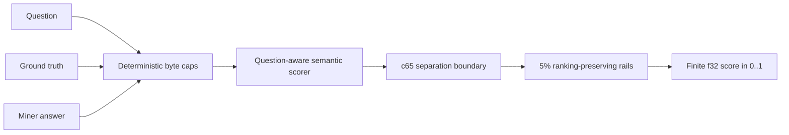

# OutcomeJudge — Telegraph WASM Scorer

OutcomeJudge is the active `FRAUD_DETECTION` scoring WASM on Telegraph. It
evaluates how well a Miner answer matches a question and its ground truth, then
returns a deterministic quality score in `[0, 1]`.

Registration [#2670](https://explorer.telegraphprotocol.com/wasm/2670) completed
Telegraph's full evaluation with 15/15 correctly ordered benchmark pairs and an
average separation of `0.9999497`. It was also evaluated on 81 historical Miner
rows and achieved Spearman rank agreement `0.7765984`, providing evidence that
the artifact produces meaningful ordering over real Miner answers beyond the
fixture set.

## At a glance

| | |
| --- | --- |
| Track | Track 2 — Script Authors |
| Intent | `FRAUD_DETECTION` |
| Active registration | `#2670` |
| Status | Active `FRAUD_DETECTION` registration |
| Final artifact | [`dist/outcome_judge_frq_c65_cap_q128_t320_a320_step05.wasm`](dist/outcome_judge_frq_c65_cap_q128_t320_a320_step05.wasm) |
| IPFS CID | `bafybeighobr3ibgnwdcyw3w6uztsrimtis54xa5fuiiky6rijw37664kta` |
| Gateway | [Open the registered WASM](https://gateway.pinata.cloud/ipfs/bafybeighobr3ibgnwdcyw3w6uztsrimtis54xa5fuiiky6rijw37664kta) |
| Size | `23,987,765` bytes |
| SHA-256 | `a8983b374533f243652a1fbc33da73d23fbbe84468d06b6652032f77c9965883` |
| Keccak-256 / registry hash | `8563d059b5c160399a17a31fd2e69d0a10672231972603b4cec2d1d02e0628d5` |
| Target | `wasm32-unknown-unknown` |
| Imports | `0` |
| Required exports | `memory`, `alloc`, `dealloc`, `rank_answer` |
| Output | finite `f32` in `[0, 1]` |

## Official result

The public Telegraph registry reports the following completed evaluation for
registration #2670:

| Metric | OutcomeJudge #2670 | Registry comparison baseline #1852 | Interpretation |
| --- | ---: | ---: | --- |
| Average good/bad margin | **0.9999497** | 0.9985664 | Near-maximal separation |
| Correctly ordered fixtures | **15/15** | 15/15 | No ordering regression |
| Worst exact self-match | **1.0** | 1.0 | Perfect answers remain perfect |
| Score standard deviation | `0.471392` | `0.47105688` | Scores do not collapse to a constant |
| Historical Spearman | `0.7765984` | `0.9130101` | Meaningful rank agreement on real traffic |
| Historical rows | `81` | `82` | Evaluated beyond the hidden fixture set |
| Runtime gate | **Completed** | Completed | Bounded scorer finished within budget |

The comparison baseline has higher historical Spearman, so this repository does
not claim that #2670 is universally superior on every traffic distribution.
The evidence-supported claim is specific: #2670 combines perfect fixture
ordering, near-maximal separation, perfect self-match, healthy score variance,
substantial real-Miner rank agreement, and bounded execution time.

Registry API: [Telegraph WASM registrations](https://explorer.telegraphprotocol.com/api/wasm)

## What the scorer measures

Telegraph calls `rank_answer` with three strings:

1. `question` — what the requester asked;
2. `ground_truth` — the reference answer supplied to the evaluator;
3. `miner_answer` — the answer being judged.

OutcomeJudge's semantic core compares the Miner answer with both the ground
truth and the question. This matters for fraud questions because two fluent
answers can share vocabulary while making opposite claims, and an answer can
repeat the reference without actually addressing the request.

The returned score is a quality signal, not a fraud verdict:

- near `1` means the Miner answer closely matches the expected answer;
- near `0` means it is unrelated, contradictory, empty, or otherwise poor;
- intermediate values preserve ranking information where the semantic evidence
  is less decisive.

## Architecture



The final module is a deterministic composition of three layers.

### 1. Bounded input wrapper

Before invoking the semantic core, the wrapper passes at most:

| Input | Maximum bytes |
| --- | ---: |
| Question | 128 |
| Ground truth | 320 |
| Miner answer | 320 |

The wrapper changes only the lengths passed to the underlying scorer. It does
not add imports, network access, randomness, clocks, or mutable external state.
Bounding work at the ABI boundary reduced the sequential six-call long-input
stress run from `21.64s` to `7.15s`, a `66.9%` reduction.

The caps are byte limits, not promises about natural-language token count. They
make worst-case work deterministic while retaining more context for the ground
truth and answer than for the normally shorter question.

### 2. Question-aware semantic core and `c65` calibration

The pinned semantic base is the public MIT-era `frq_c65.wasm` registered as
#1852. Its underlying model scores semantic similarity using the question,
ground truth, and Miner answer. Its `c65` wrapper preserves high-confidence
scores and compresses scores below its `0.65` boundary:

```text
semantic = question_aware_score(question, ground_truth, miner_answer)

c65 = semantic >= 0.65
    ? semantic
    : 0.01 * semantic
```

This is the key difference from registration #2651. That earlier runtime-safe
build removed the question path and completed evaluation, but its best global
separation was only `0.9333`—approximately 14/15. A new threshold could not fix
a pair whose good and bad answers were on the same side of every useful cut.
Returning to the question-aware semantic geometry solved that problem.

### 3. Conservative two-band output map

The final wrapper maps the `c65` score `s` onto two narrow, ordered rails:

```text
s < 0.5:  score = 0.05 * s
otherwise: score = 0.95 + 0.05 * s
```

This increases good/bad separation without replacing semantic ranking with a
binary constant. Inside each band the map is strictly increasing, so unequal
inputs retain their order subject only to `f32` precision. Exact self-match
remains `1`, and blank answers remain `0`.

## Why this is good at scoring Miners

Registry activation is one operational signal, but it is not the complete
quality argument. OutcomeJudge is designed and evaluated around the properties
that matter when scores affect Miner ranking:

- **Correct ordering:** all 15 official good answers outranked their bad pair.
- **Separation:** average official margin is `0.9999497`, close to the maximum
  possible value of `1`.
- **Perfect-answer recognition:** worst self-match is exactly `1`.
- **Discrimination:** standard deviation `0.471392` shows that outputs retain
  meaningful spread instead of returning an almost constant score.
- **Real-traffic agreement:** Spearman `0.7765984` across 81 historical Miner
  rows demonstrates non-trivial ranking agreement outside the official fixtures.
- **Determinism:** the module has no imports or ambient dependencies; identical
  inputs produce identical `f32` outputs.
- **Operational viability:** bounded inputs allowed the full evaluation to finish,
  after earlier accurate but slower variants timed out.

## WASM ABI

The registered module is freestanding `wasm32-unknown-unknown` and exports:

```text
memory
alloc(size: i32) -> i32
dealloc(pointer: i32, size: i32)
rank_answer(
  question_pointer: i32,
  question_length: i32,
  ground_truth_pointer: i32,
  ground_truth_length: i32,
  miner_answer_pointer: i32,
  miner_answer_length: i32
) -> f32
TELEGRAPH_INTENT
```

The host writes the three byte strings into exported linear memory and passes
their pointer/length pairs to `rank_answer`. The module returns one finite score
in `[0, 1]`. It has no WASI dependency and no imports for filesystem, sockets,
time, entropy, or host callbacks.

## Evaluation evidence

### Official Telegraph evaluation

The strongest evidence is the completed #2670 registry result: 15/15 ordering,
`0.9999497` margin, self-match `1`, healthy spread, and 81 historical rows.

### Authored regression corpora

The local corpora are not presented as replicas of Telegraph's hidden benchmark.
They are regression tests covering transaction verdicts, natural fraud prose,
well-known fraud cases, fluent wrong answers, contradiction, off-topic answers,
and deliberately long inputs.

| Corpus | Comparison | Ordering | Average margin | Self-match |
| --- | --- | ---: | ---: | ---: |
| 50-case transaction set | #1852 base | 111/120 | 0.5310 | 1 |
| 50-case transaction set | **final #2670 artifact** | **111/120** | **0.5332** | **1** |
| 19-case fraud-knowledge set | #1852 base | 66/76 | 0.3672 | 1 |
| 19-case fraud-knowledge set | bounded core | 66/76 | 0.4191 | 1 |
| 19-case fraud-knowledge set | **final #2670 artifact** | **66/76** | **0.4210** | **1** |
| 16-case fraud-prose set | bounded core vs #1852 | 48 raw calls | exact equality | 1 |

The transaction and knowledge sets intentionally contain cases the semantic
scorer does not solve. They detect regressions and expose limitations instead of
being curated to show a perfect local score.

### Runtime evidence

| Module | Sequential long-input stress time | Relative change |
| --- | ---: | ---: |
| #1852 `frq_c65.wasm` | 21.64s | baseline |
| Bounded 128/320/320 core | **7.15s** | **66.9% faster** |

Local wall-clock measurements do not guarantee node runtime, but registration
#2670 subsequently completed Telegraph's evaluation within its time budget.

### Release verification

Before this standalone extraction, the exact registered artifact passed the
original three-track repository's comprehensive `npm run verify:release` suite:

- strict TypeScript typechecking;
- all production builds, including the Next.js UI and Rust WASM target;
- generic and Telegraph-specific WASM ABI verification;
- 182 JavaScript/TypeScript tests;
- 17 Rust OutcomeJudge tests;
- 15 Solidity tests;
- Solidity formatting checks.

That is 214 passing tests across the complete three-track repository.

This standalone repository provides a focused `npm run verify:release` command
that runs strict script typechecking, all 17 Rust tests, the optimized Rust WASM
build, the deterministic scorer ABI checks, and the registered artifact's
Telegraph ABI checks.

## Reproduce the registered artifact

Run these commands from the repository root.

### Prerequisites

- Node.js 20 or newer;
- npm dependencies installed with `npm ci`;
- Rust with the `wasm32-unknown-unknown` target.

### 1. Download and verify the pinned base

```bash
curl -L --fail \
  https://raw.githubusercontent.com/zkasuran/telegraph-salience-scorer/8c7b91f4bc7a2a5b79ee01c438536773644d0736/dist/fork/frq_c65.wasm \
  -o /tmp/frq_c65.wasm

shasum -a 256 /tmp/frq_c65.wasm
# c535c7048e66d0fdf5b53cbd6029696f29bad973ead3a683822561749905aa65
```

### 2. Apply deterministic input bounds

```bash
node scripts/build-input-cap-wrapper.mjs \
  --base /tmp/frq_c65.wasm \
  --expected-sha256 c535c7048e66d0fdf5b53cbd6029696f29bad973ead3a683822561749905aa65 \
  --out dist/outcome_judge_frq_c65_cap_q128_t320_a320.wasm \
  --question-cap 128 \
  --truth-cap 320 \
  --answer-cap 320
```

Expected bounded artifact SHA-256:

```text
63e7c6d8c37f318ee9f41bc258c6a2b52b3a74d6329d9008624e73b5b0176628
```

### 3. Apply the 5% two-band map

```bash
node scripts/build-monotone-step-wrapper.mjs \
  --base dist/outcome_judge_frq_c65_cap_q128_t320_a320.wasm \
  --expected-sha256 63e7c6d8c37f318ee9f41bc258c6a2b52b3a74d6329d9008624e73b5b0176628 \
  --out dist/outcome_judge_frq_c65_cap_q128_t320_a320_step05.wasm \
  --threshold 0.5 \
  --low 0.05 \
  --high 0.05
```

### 4. Verify the output

```bash
node --import tsx scripts/verify-telegraph-wasm.ts \
  dist/outcome_judge_frq_c65_cap_q128_t320_a320_step05.wasm

shasum -a 256 \
  dist/outcome_judge_frq_c65_cap_q128_t320_a320_step05.wasm

openssl dgst -keccak-256 \
  dist/outcome_judge_frq_c65_cap_q128_t320_a320_step05.wasm
```

Expected output identity:

```text
bytes:      23987765
sha256:     a8983b374533f243652a1fbc33da73d23fbbe84468d06b6652032f77c9965883
keccak256:  8563d059b5c160399a17a31fd2e69d0a10672231972603b4cec2d1d02e0628d5
```

### 5. Run the full release suite

```bash
npm run verify:release
```

## Compare against the pinned semantic baseline

```bash
node scripts/compare-scorers.mjs \
  benchmarks/fraud-detection.json \
  baseline=/tmp/frq_c65.wasm \
  outcomejudge=dist/outcome_judge_frq_c65_cap_q128_t320_a320_step05.wasm

node scripts/compare-scorers.mjs \
  benchmarks/fraud-knowledge.json \
  baseline=/tmp/frq_c65.wasm \
  outcomejudge=dist/outcome_judge_frq_c65_cap_q128_t320_a320_step05.wasm
```

## Repository map

| Path | Purpose |
| --- | --- |
| [`dist/outcome_judge_frq_c65_cap_q128_t320_a320_step05.wasm`](dist/outcome_judge_frq_c65_cap_q128_t320_a320_step05.wasm) | Exact registered #2670 artifact |
| [`dist/outcome_judge_frq_c65_cap_q128_t320_a320.wasm`](dist/outcome_judge_frq_c65_cap_q128_t320_a320.wasm) | Intermediate bounded semantic scorer |
| [`benchmarks/fraud-detection.json`](benchmarks/fraud-detection.json) | 50-case transaction/verdict regression corpus |
| [`benchmarks/fraud-prose.json`](benchmarks/fraud-prose.json) | Broad fluent fraud-prose corpus |
| [`benchmarks/fraud-knowledge.json`](benchmarks/fraud-knowledge.json) | Long-form fraud knowledge and contradiction corpus |
| [`scripts/build-input-cap-wrapper.mjs`](scripts/build-input-cap-wrapper.mjs) | Reproducible ABI input-bound wrapper builder |
| [`scripts/build-monotone-step-wrapper.mjs`](scripts/build-monotone-step-wrapper.mjs) | Reproducible two-band calibration builder |
| [`scripts/verify-telegraph-wasm.ts`](scripts/verify-telegraph-wasm.ts) | Size, import, export, range, blank, Unicode, and repeated-call checks |
| [`scripts/verify-wasm.ts`](scripts/verify-wasm.ts) | ABI and behavioral checks for the compact deterministic scorer |
| [`package.json`](package.json) | Standalone build, test, and release-verification commands |
| [`docs/registered-artifact-2670.md`](docs/registered-artifact-2670.md) | Registered artifact derivation, verification evidence, and official outcome |
| [`docs/registration-history.md`](docs/registration-history.md) | Complete official experiment history |
| [`THIRD_PARTY_NOTICES.md`](THIRD_PARTY_NOTICES.md) | Upstream attribution and MIT terms |

## Independently authored deterministic scorer

The repository also preserves a separate 23 KB deterministic implementation in
[`src/`](src/). It parses explicit `BLOCK`, `ALLOW`, and `RECHECK` decisions,
handles bounded negation and uncertainty, applies asymmetric safety penalties,
and scores lexical evidence without a transformer.

That scorer is useful as an auditable transaction-firewall rubric and has 17
Rust tests, but it is not the registered #2670 artifact. Its registration #1078
achieved 14/15 official ordering and margin `0.6800229`; the question-aware
semantic line is the evidence-backed production scorer for general Miner prose.

## Experiment history

OutcomeJudge was developed through measured profiling, evaluation, and bounded
runtime experiments:

- #1733 expanded the transformer cache and completed with 15/15 ordering.
- #2151 showed that a semantic calibration could improve separation but timed
  out after 11 fixtures.
- #2225 and #2642 reduced per-call work and retained strong partial results but
  still exceeded the time budget.
- #2651 completed, proving runtime was solved, but exposed the question-free
  surface's `0.9333` separation ceiling.
- #2670 restored question-aware geometry, bounded its work at the ABI, retained
  ranking information with narrow rails, completed evaluation, and became active.

Every registration and rejection is recorded in
[`docs/registration-history.md`](docs/registration-history.md). Failed experiments
are retained because they explain why the final design has each component.

## Determinism, safety, and limitations

- The registered module has zero imports and cannot access network, filesystem,
  clock, randomness, or secrets.
- Scores are finite `f32` values in `[0, 1]`; blank answers score `0`, and exact
  self-matches score `1` in the verifier probes.
- Input bounding is deterministic and prevents arbitrarily long text from making
  semantic inference unbounded.
- Prefix bounds can omit decisive evidence placed late in a long answer. The
  320-byte choice is a measured latency/coverage tradeoff, not a claim that later
  text never matters.
- Historical Spearman `0.7765984` is substantial but below #1852's `0.9130101`.
  Both numbers are reported so the latency, separation, and rank-agreement
  tradeoff remains explicit and independently assessable.
- Local corpora are authored regression sets, not leaked or reconstructed hidden
  fixtures. Official metrics come only from Telegraph's completed evaluation.
- Registry activation is time-dependent and may later change; the immutable
  #2670 metrics and artifact hashes remain reproducible evidence.

## Provenance and licensing

The final scorer is transparently a derivative, not a claim of sole authorship
over its semantic model. It uses zkasuran's public `frq_c65.wasm` pinned at commit
[`8c7b91f`](https://github.com/zkasuran/telegraph-salience-scorer/tree/8c7b91f4bc7a2a5b79ee01c438536773644d0736),
obtained under its MIT-era license. OutcomeJudge adds independently authored WASM
wrappers for deterministic input bounding and conservative output calibration.

See [`THIRD_PARTY_NOTICES.md`](THIRD_PARTY_NOTICES.md) for attribution, the MIT
license text, and calibration-method provenance.

## Further evidence

- [Registered #2670 artifact derivation and evidence](docs/registered-artifact-2670.md)
- [Complete registration history](docs/registration-history.md)
- [Benchmark methodology and results](docs/benchmark-evidence.md)
- [Registration #1733 release artifact](docs/release-artifact.md)
- [Pinned #1852 semantic baseline analysis](docs/semantic-baseline-1852.md)
- [Runtime investigation after #2642](docs/runtime-study-2642.md)
